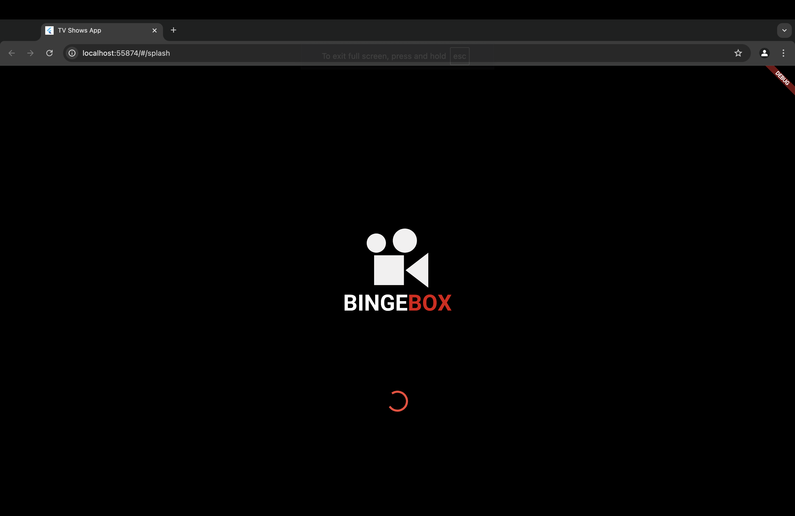
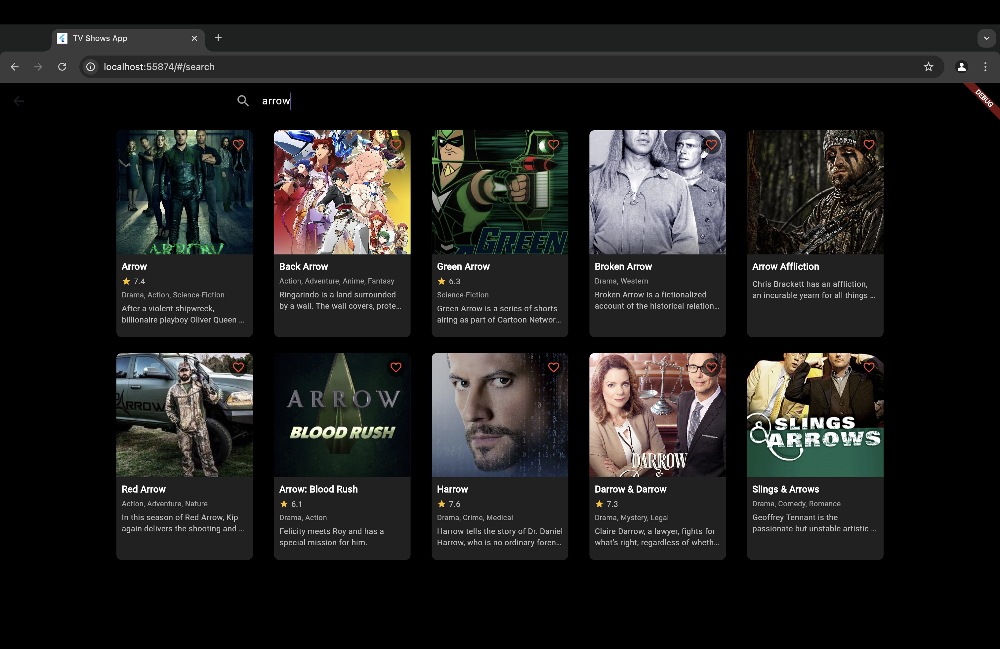
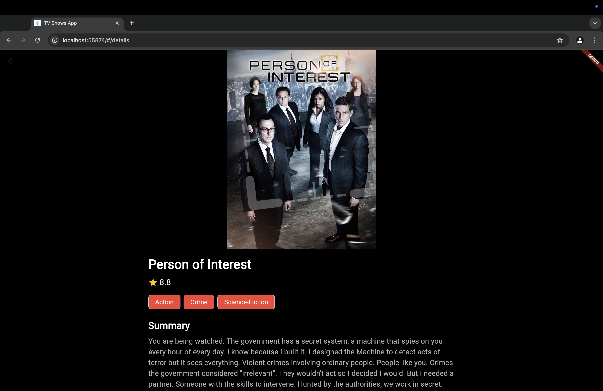
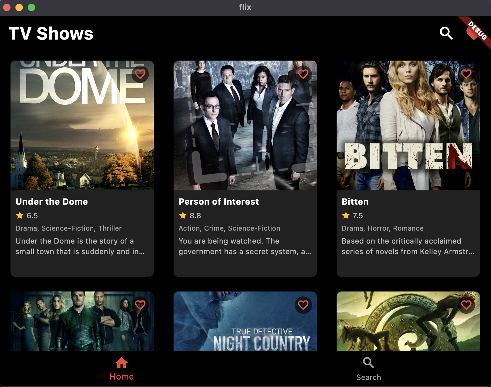
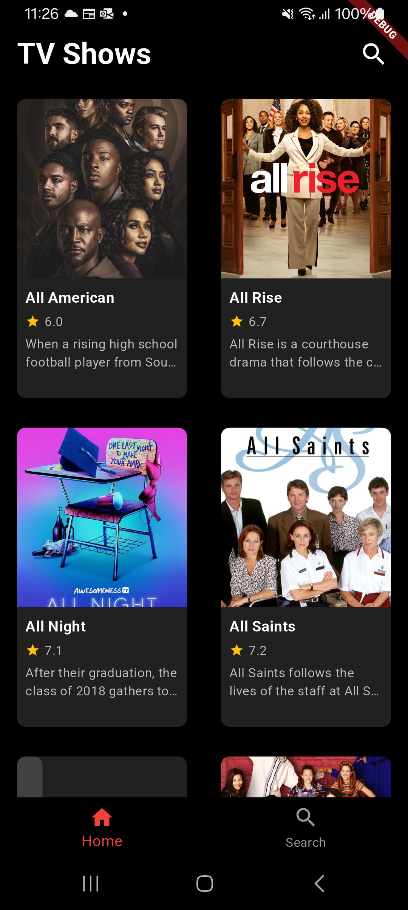

### Project for QuadB Tech by Vivek Ray:-

# Meet BingeBox 📺

Your ultimate companion for discovering and tracking TV shows. BingeBox is a sleek, Netflix-inspired Flutter application that brings the world of television entertainment to your fingertips. Whether you're searching for your next binge-worthy series or keeping track of your favorites, BingeBox has got you covered.

## 📱 App Screens

<table>
  <tr>
    <td align="center">
      
       <em>Splash Screen - Welcoming users with an elegant animated logo</em>
    </td>
    <td align="center">
      
       <em>Home Screen - Browse trending and popular TV shows</em>
    </td>
  </tr>
  <tr>
    <td align="center">
      
       <em>Search Screen - Find your favorite shows instantly</em>
    </td>
    <td align="center">
      
       <em>Details Screen - In-depth information about shows</em>
    </td>
  </tr>
  <tr>
    <td align="center" colspan="2">
      
       <em>Favorites Screen - Quick access to your saved shows</em>
    </td>
  </tr>
</table>

## 🌐 Cross-Platform Experience

BingeBox provides a seamless experience across multiple platforms while maintaining its sleek design and functionality.

### 💻 Web Version

  
   <em>Optimized for browser experience with responsive design</em>

### 🖥️ Desktop & Mobile Apps
<table>
  <tr>
    <td align="center">
      
       <em>macOS Desktop App - Native experience with system integration</em>
    </td>
    <td align="center">
      
       <em>Android Mobile App - Material design with full feature set</em>
    </td>
  </tr>
</table>

### Platform-Specific Features

#### 🌐 Web
- ✅ Responsive grid layout
- ✅ Keyboard shortcuts for navigation
- ✅ Browser history integration
- ✅ Optimized for larger screens
- ✅ Cross-browser compatibility

#### 🖥️ macOS
- ✅ Native menu bar integration
- ✅ System notifications
- ✅ Trackpad gestures support
- ✅ Window management features
- ✅ Touch bar support

#### 📱 Android
- ✅ Material Design 3 implementation
- ✅ Push notifications
- ✅ Offline data caching
- ✅ Share functionality
- ✅ Adaptive layouts for different screen sizes

## ✨ Features

### Core Features
- Modern and responsive UI with Netflix-inspired design
- Browse popular TV shows
- Search functionality with real-time results
- Detailed show information including ratings, genres, and summaries
- Bottom navigation for easy screen switching
- Splash screen with animated logo

### Additional Features
- Favorite shows functionality with local storage persistence
- Infinite scroll pagination for smooth browsing experience
- Responsive grid layout adapting to different screen sizes
- Pull-to-refresh functionality
- Error handling with retry options
- Loading states and animations
- Hero animations for smooth transitions
- Debounced search to optimize API calls
- HTML tag stripping for clean text display
- Offline favorites access
- Snackbar notifications for user actions
- Undo functionality for favorites

